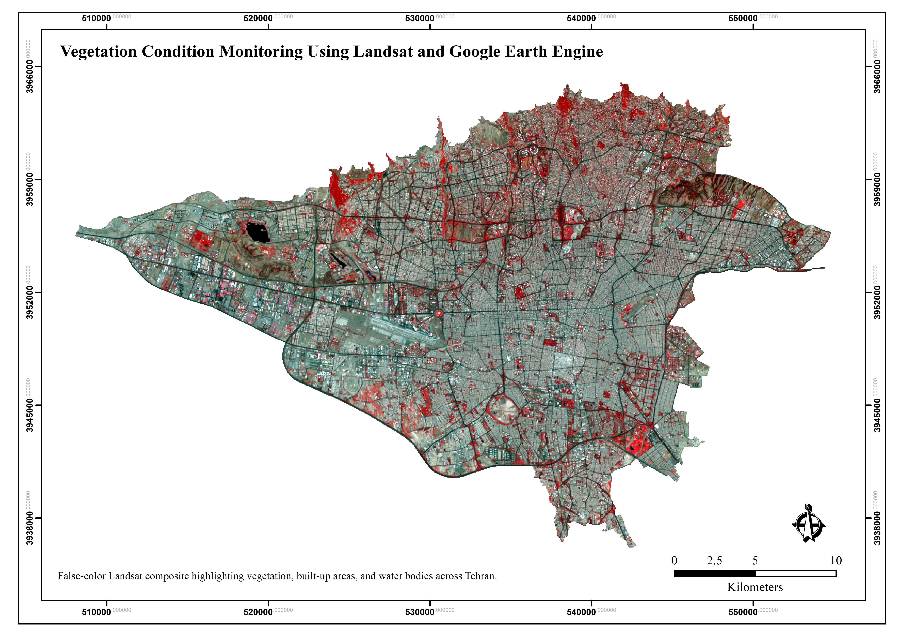
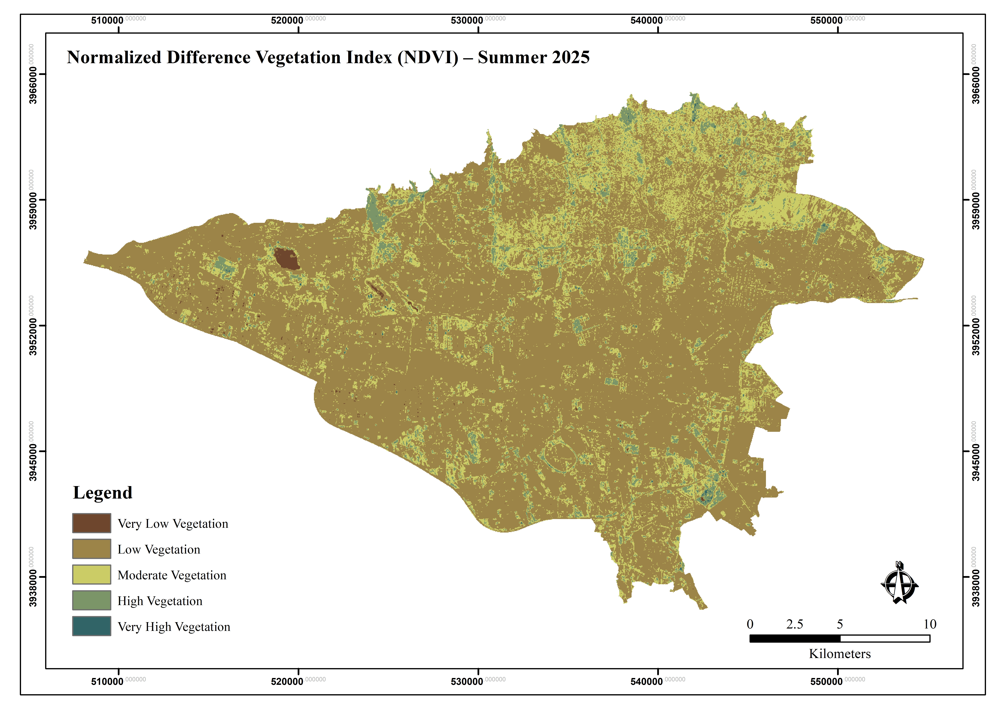
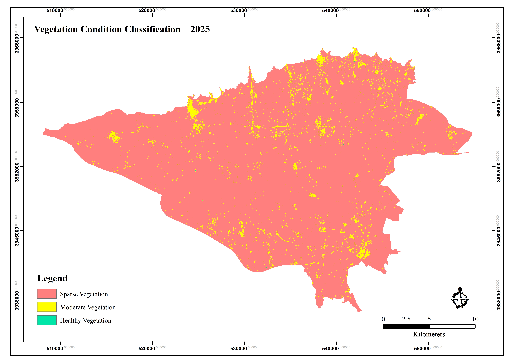
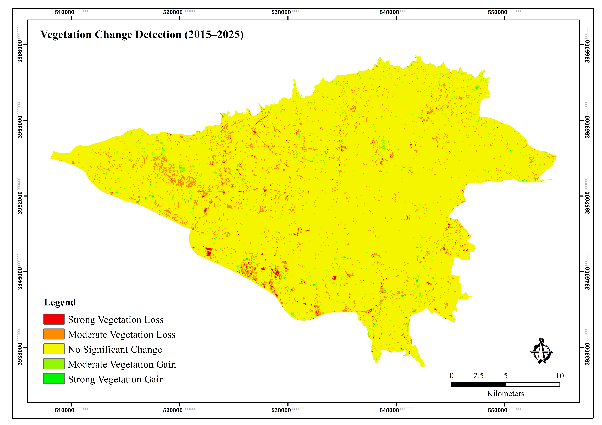

# vegetation-condition-monitoring-gee
Remote sensing workflow for vegetation condition assessment and vegetation change detection using Landsat imagery and Google Earth Engine.
# Vegetation Condition Monitoring Using Landsat & Google Earth Engine

## Overview

This project presents a remote sensing workflow for vegetation condition assessment and vegetation change detection using multi-temporal Landsat imagery and Google Earth Engine.

The workflow was developed to support environmental monitoring, ecosystem assessment, land cover analysis, and carbon-related GIS applications.

---

## Project Objectives

* Calculate NDVI from Landsat imagery
* Assess vegetation condition across the study area
* Classify vegetation health categories
* Detect vegetation gain and loss between 2015 and 2025
* Generate GIS-ready raster products
* Produce cartographic outputs for reporting and decision support

---

## Data Sources

* Landsat 8/9 Collection 2 Level 2
* Google Earth Engine
* Administrative boundary data

---

## Workflow

1. Cloud masking and image preprocessing
2. Summer Landsat composite generation
3. NDVI calculation
4. Vegetation condition classification
5. Vegetation change detection (2015–2025)
6. Raster export (GeoTIFF)
7. Cartographic map production in ArcGIS Pro

---

## Key Outputs

### False Color Composite

Satellite composite highlighting vegetation, built-up areas, and water bodies.

---

### NDVI Map

Spatial distribution of vegetation condition derived from Landsat imagery.

---

### Vegetation Condition Classification

Classification of vegetation condition into sparse, moderate, and healthy vegetation classes.

---

### Vegetation Change Detection (2015–2025)

Identification of vegetation gain and vegetation loss over a 10-year period.

---

## Tools & Technologies

* Google Earth Engine
* ArcGIS Pro
* Landsat 8/9
* Remote Sensing
* Raster Analysis
* Environmental GIS

---

## Applications

* Vegetation Monitoring
* Environmental Assessment
* Land Cover Mapping
* Carbon Projects
* Ecosystem Monitoring
* Natural Resource Management

---

## Repository Contents

### Google Earth Engine Code

`gee_code/vegetation_monitoring.js`

### Maps

`maps/`

### GIS Outputs

`outputs/`

### Project Portfolio

`docs/portfolio.pdf`

---

## Author

Nahid Nemati

GIS & Remote Sensing Analyst
